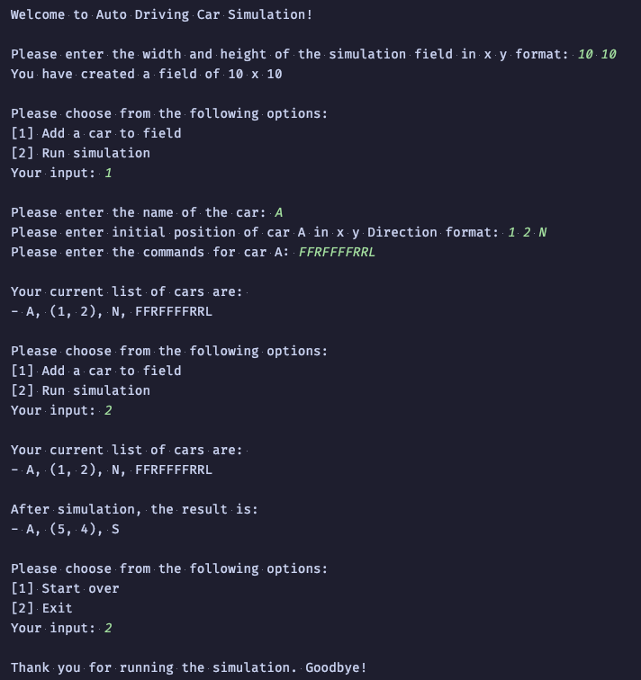
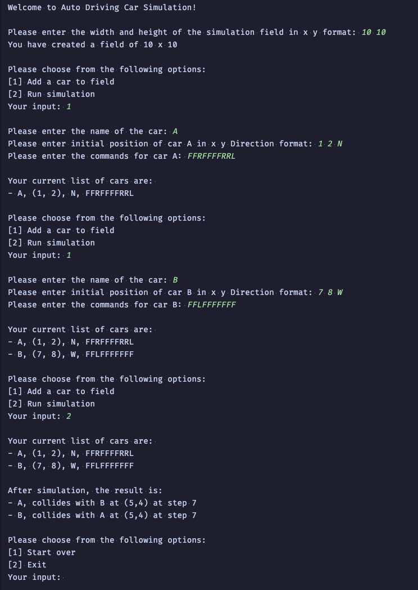

# Auto Driving Car Simulator

## Tech Stack

1. Kotlin 2.0
2. JDK 21

## How to run
### CLI Application
- Invoke `main()` in `AutoDrivingCarSimulator.kt`
- Execute at project root `./gradlew run -q --console=plain` 
### Test Evidences | [Test Report](test-report/index.html)
- Execute at project root `./gradlew test`. Will generate an HTML test report at `{projectDir}/test-report`
### Scenario 1

### Scenario 2

## Technical Decisions

- Test driven development (TDD) approach was used to cover of all the different known scenarios that may occur in the
  field.
- To keep the application simple, a basic CLI that reads `System.in` was used for user input.
- The control centre will be the one responsible in instructing the car of the next operation and detecting if any
  collisions occur.
- Kept dependencies to a minimum with only `JUnit 5` and `AssertJ` for test and `ktlint` to avoid bikeshedding.

## Assumptions

### Console

- No specified expected behaviour if invalid input is provided. Console will continuously parse for input if invalid
  value is provided.

### Field

- No limit constraint was specified for the field size, thus max limit of `Long` data type is used.
- No error handling was specified for **negative** field size. Prevent creation of field if negative value is provided.

### Simulation

- Car name is made mandatory and unique (case-sensitive).
- Stop moving the car if the new coordinate detected is outside the specified field
  size `(e.g. o <= x <= width, o <= y <= height)`.
- Stop moving the car if collision at initial state is detected.
- If more than 1 collision occurs in the field (e.g. 3 cars are in a collision), use the latest step count to reflect on
  which step all the cars went into collision
